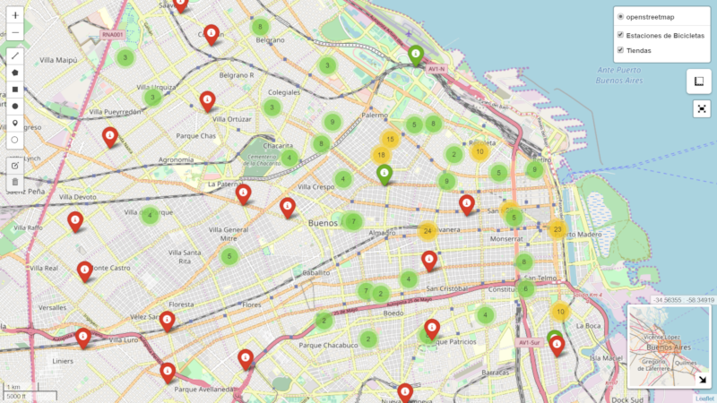

# Bicicletas Públicas -- Argentina, Capital Federal.

[](https://mybinder.org/)
[](https://colab.research.google.com)


**Descripcion:** El presente repositorio se desarrolla contexto del conjunto de DATASETS referentes al uso de las biclicletas públicas argentinas en CABA, en el cual se buscar describir el comportamiento de entradas y salidas de la estacion de los usuario.

**Objetivo:**

- Evaluar el comportamiento del uso de las ciclovías, tomando como referencia:
    - Factores climáticos.
        - Lluvia.
        - Temperatura.
    - Dias no laborales en el calendario.
    
 ## Fuente de datos:
 
 <a href="https://data.buenosaires.gob.ar/"></a>
 
- [Buenos Aires Data](https://data.buenosaires.gob.ar/), repositorio general de datos - Capital Federal
- [Movilidad y Trasporte - Bicicletas Públicas](https://data.buenosaires.gob.ar/dataset/bicicletas-publicas), repositorio de caso de estudio.

## DESCRIPCION - DATASETS

Se trabaja sobre un conjunto de data sets:

```python
- #df_2010.csv
    - columns=['PERIODO', 'ORIGENFECHA', 'ORIGENESTACIONID', 'ORIGENNOMBRE', 'DESTINOFECHA',
               'DESTINOESTACIONID', 'DESTINONOMBRE', 'TIEMPOUSO']
    - sep=';'
- #df_2011.csv
    - columns=['PERIODO', 'ORIGENFECHA', 'ORIGENESTACIONID', 'NOMBREORIGEN', 'DESTINOFECHA',
               'DESTINOESTACIONID', 'NOMBREDESTINO', 'TIEMPOUSO']
    - sep=';'
- #df_2012.csv
    - columns=['PERIODO', 'ORIGENFECHA', 'ORIGENESTACIONID', 'ORIGENNOMBRE', 'DESTINOFECHA',
               'DESTINOESTACIONID', 'DESTINONOMBRE', 'TIEMPOUSO']
    - sep=';'
- #df_2013.csv
    - columns=['ID', 'NOMBRE_ORIGEN', 'ORIGEN_FECHA', 'DESTINO_ESTACION', 'DESTINO_FECHA']
    - sep=';'
- #df_2014.csv
    - columns=['ID', 'NOMBRE_ORIGEN', 'ORIGEN_FECHA', 'DESTINO_ESTACION', 'DESTINO_FECHA']
    - sep=';'
- #df_2015.csv
    - columns=['periodo', 'genero', 'fecha_hora_retiro', 'origen_estacion', 'nombre_origen', 
               'destino_estacion', 'nombre_destino, tiempo_uso']
    - sep=','
- #df_2016.csv
    - columns=['periodo', 'genero', 'fecha_hora_retiro', 'origen_estacion', 'nombre_origen', 
               'destino_estacion', 'nombre_destino', 'tiempo_uso']
    - sep=','
- #df_2017.csv
    - columns=['periodo', 'genero', 'fecha_hora_retiro', 'origen_estacion', 'nombre_origen', 
               'destino_estacion', 'nombre_destino', 'tiempo_uso']
    - sep=','
- #df_2018.csv
     - columns=['id_usuario', 'bici_fecha_hora_retiro', 'bici_tiempo_uso', 'bici_nombre_estacion_origen',
                'bici_estacion_origen', 'bici_nombre_estacion_destino', 'bici_estacion_destino', 'bici_sexo', 'bici_edad']
     - sep=','

```

Podemos observar que para cada período, los datos presentan diferentes  número de atributos, y que las columnas que contienen el mismo atributo diferen en el nombre, por lo tanto, en principio no resulta posible plantear un estudio geneneral para todos los años.

## MAIN WORKFLOW

- `CasoInicio.ipynb:` Se trabaja sobre todos los datos, dejando defindas todas las funciones, para trabajar con data frames limpios con formato y lo más homogeneos posible. **[Sin Iniciar]**

- `Caso2010..2018.ipynp:` Un notebook para estudiar individualmente cada dataframe.
  - df_2010: **[Sin Iniciar]**
  - df_2011: **[Sin Iniciar]**
  - df_2012: **[Sin Iniciar]**
  - df_2013: **[Sin Iniciar]**
  - df_2014: **[Sin Iniciar]**
  - df_2015: **[Sin Iniciar]**
  - df_2016: **[Sin Iniciar]**
  - df_2017: **[Sin Iniciar]**
  - df_2018: **[Iniciado]**
  
- `CasoGeneral.ipynb:` Se hace un estudio tomando en cuenta todos los periodos.
  - Estado: **[Sin Iniciar]**


## Instalación

Se remcomienda clonar este repositorio o copiar manualmente el fichero `localpacks` en el directorio de trabajo.

## Uso

```python
from localpacks.maps import draw_map, draw_mult_map
from localpacks.data import get_data,format_data, clean_garbage

df_geo = get_data()
df_tienda = get_data()

draw_mult_map(df_geo,tiendas)

```
)

**nota:** localpacks es un paquete diseñado específicamente para trabajar con estos datasets.


## Acerca de localpacks

Se trata de un concepto genérico que promueve como flujo de trabajo, ir compilando el código generado inicialmente en las notebooks en paquetes python.

## License


This project is released under an `MIT`.